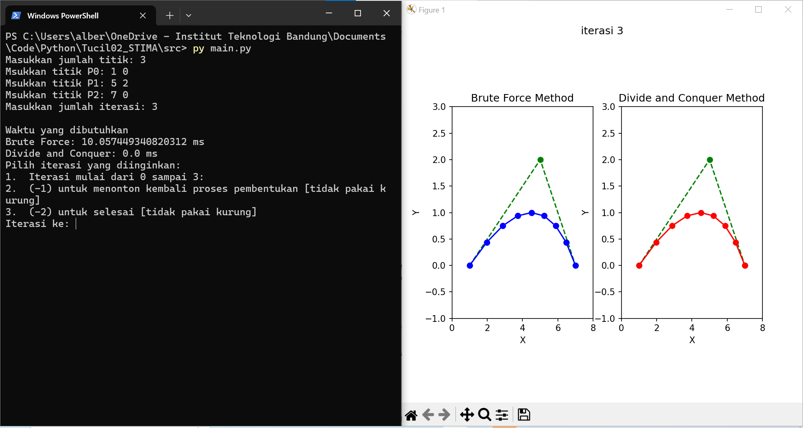

# Tucil02_STIMA
> Membangun Kurva Bézier dengan Algoritma Titik Tengah berbasis Divide and Conquer 

## Table of Contents
* [General Information](#general-information)
* [Features](#Features)
* [Technology Used](#technoogy-used)
* [Screenshots](#screenshots)
* [Setup](#setup)
* [Usage](#usage)
* [Profile](#profile)
## General Information
Kurva Bézier adalah kurva yang digunakan luas dalam desain grafis, animasi, dan manufaktur karena kemampuannya menciptakan kurva halus. Kurva ini dibentuk oleh titik-titik kontrol yang menentukan bentuk dan arahnya. Pembuatan kurva Bézier relatif mudah dengan menghubungkan titik-titik kontrolnya. Kurva ini memiliki aplikasi praktis dalam berbagai bidang, seperti alat pena dalam perangkat lunak desain grafis, animasi realistis, desain produk yang kompleks, dan pembuatan font yang artistik. Keunggulan kurva Bézier adalah kemampuannya untuk diubah dan dimanipulasi dengan mudah, sehingga memungkinkan pembuatan desain yang presisi dan sesuai dengan kebutuhan.

## Features
- Implementasi Bernstein Polynomial
- Implementasi de Casteljau Algoritm
- Kalkulasi waktu algortima
- Animasi proses pembuatan grafik
## Technoogy Used
* python - version 3.12.0
* numpy - version 1.26.1
* matplotlib - version 3.8.3
## Screenshots

## Setup
    git clone https://github.com/albert260302/Tucil2_13522150.git
    pip install numpy
    pip install matplotlib
## Usage
    cd src
    py main.py

# Profile
* Nama: Albert Ghazaly
* NIM: 13522150
* Kelas: K03
* Cita-Cita: Masuk Surga
* Hobi: Mancing dan Kulineran

